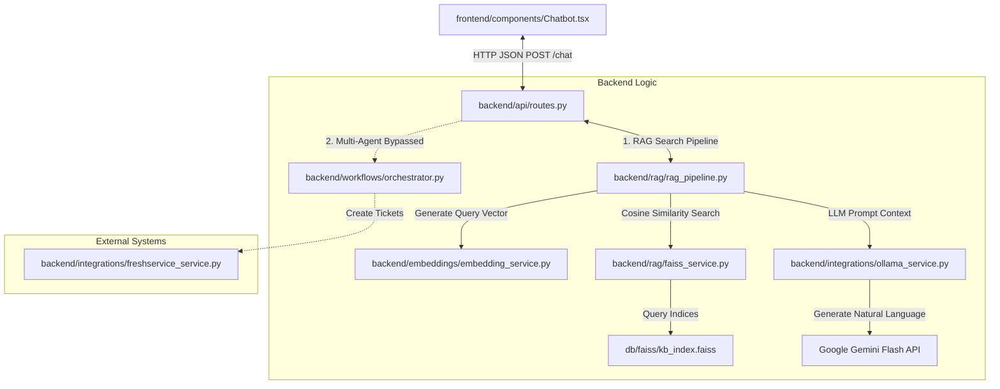

# AI Service Desk Assistant

Enterprise AI Service Desk Assistant integrated with Elixir Portal and Freshservice.

## Features
- Conversational AI support (Powered by local Gemma 2B via Ollama)
- Semantic Search over KB Articles & FAQs (pgvector + BAAI/bge-small-en-v1.5)
- Automated Freshservice Ticket Creation
- Conversation Memory
- Intent Detection

## Architecture
- **Frontend**: React + Next.js, Tailwind CSS
- **Backend**: Python FastAPI
- **Database**: PostgreSQL with `pgvector`
- **AI Stack**: LangChain, LangGraph, Model (Gemini-3.5-flash)

## Prerequisites
- **Python**: v3.10+
- **Node.js**: v18+
- **Docker & Docker Compose** (not require in dev mode, but use for running PostgreSQL and Redis)
- **Ollama** (optional, if running models locally)

## Setup

1. **Configure Environment Variables**:
   Copy `.env.example` to `.env` in both the project root and `backend` directories, then populate them with your credentials (such as database credentials, Gemini API keys, and Freshservice credentials):
   ```bash
   cp .env.example .env
   ```

2. **Start Infrastructure Services**:
   Spin up PostgreSQL (with `pgvector` extension) and Redis using Docker Compose:
   ```bash
   docker-compose up -d
   ```

3. **Initialize the Database Schema**:
   Run Alembic migrations to set up the SQL table schemas:
   ```bash
   cd backend
   alembic upgrade head
   ```

4. **Seed Knowledge Base & Seeding Data**:
   Populate the Postgres tables with standard categories and compile the vector database (FAISS indices) by running the enterprise seeding script:
   ```bash
   python ingestion/seed_enterprise_data.py
   ```
   *Note: This creates the local text manual guidelines, builds the FAISS indexes inside the `/db/faiss/` folder, and sets up ITSM categories.*

---

## Development

Run backend locally:
```bash
cd backend
# Create a virtual environment (optional but recommended)
python -m venv venv

# Activate the virtual environment
# On Windows:
.\venv\Scripts\activate
# On Linux/macOS:
source venv/bin/activate

# Install the dependencies
pip install -r requirements.txt

# Run the server
uvicorn main:app --reload
```

Run frontend locally:
```bash
cd frontend
npm install
npm run dev
```


# AI Service Desk Chatbot - Detailed Architectural Guide

Yes, the proposed architecture is **correct** and maps directly to the operational flow of your AI Service Desk Chatbot system.

Below is a detailed breakdown of each layer, how they link together, and the exact code snippets that implement this data flow.

---

## 1. System Architecture Map



---

## 2. Layer-by-Layer Detail with Code Snippets

### Layer 1: HTTP JSON REST API Gateway
* **Component**: [frontend/components/Chatbot.tsx](file:///d:/AI%20Elixir%20Chatbot/frontend/components/Chatbot.tsx) and [backend/api/routes.py](file:///d:/AI%20Elixir%20Chatbot/backend/api/routes.py)
* **How it works**: 
  1. The React frontend gathers user text inputs and optional base64 attachment files (images/documents) inside `Chatbot.tsx`.
  2. It performs an asynchronous `POST` HTTP request to the backend's `/chat` endpoint.
  3. The backend API route (`routes.py`) manages session keys, parses base64 files (using **EasyOCR** for images or **MarkItDown** for word docs), stores chat history in SQLite database tables, and initializes the RAG Pipeline.

#### Code Snippet (REST Endpoint):
```python
# From backend/api/routes.py
@router.post("/chat", response_model=ChatResponse)
async def chat(request: ChatMessageRequest, background_tasks: BackgroundTasks, db: Session = Depends(get_db)):
    # ... session handling and OCR processing ...
    
    # 1. Try to query the RAG pipeline
    rag_pipeline = RAGPipeline(db)
    rag_result = await rag_pipeline.process_query(final_message, session_history=history[:-1])
    
    # 2. Check if high-confidence matches are found
    if rag_result.get("confidence", 0.0) >= 0.40 and rag_result.get("sources"):
        response_text = rag_result["response"]
        sources = rag_result["sources"]
        routing = ["RAG_Search"]
    else:
        # Fall back to raw model chat for open-ended conversation
        response_text = await ollama_service.generate_response(
            prompt=final_message,
            system_prompt=f"{context_prompt}You are a helpful AI assistant. Answer the user's question directly."
        )
        sources = []
        routing = ["OpenChat_ModelDirect"]
```

---

### Layer 2: RAG Pipeline
* **Component**: [backend/rag/rag_pipeline.py](file:///d:/AI%20Elixir%20Chatbot/backend/rag/rag_pipeline.py)
* **How it works**: 
  1. Classifies general user intents (like `GREETING`).
  2. Queries the Vector Search Service across local knowledge base manuals, FAQs, and past historical support tickets.
  3. Formulates a system prompt using retrieved manual contexts, and queries the LLM service to compile the answer.
  4. Sanitizes output strings (such as converting raw mathematical arrows into `"then go to"` and stripping comparative system text warnings).

#### Code Snippet (RAG Processor):
```python
# From backend/rag/rag_pipeline.py
async def process_query(self, query: str, session_history: List[Dict[str, str]] = None) -> Dict[str, Any]:
    # ... Intent classification & search queries ...
    
    # 1. Search Knowledge Base, FAQs, and Historical Tickets
    kb_results = self.search_service.search_kb(search_query, top_k=3)
    faq_results = self.search_service.search_faq(search_query, top_k=2)
    ticket_results = self.search_service.search_historical_tickets(query, top_k=2)
    
    # Merge & check thresholds
    all_results = kb_results + faq_results + ticket_results
    valid_results = [r for r in all_results if r['score'] > 0.40]
    
    # Build context string
    context_str = "\n\n---\n\n".join(context_parts)
    prompt = RAG_PROMPT_TEMPLATE.format(context=context_str, question=query)
    
    # Generate LLM response
    response = await self.llm_service.generate_response(prompt, SYSTEM_PROMPT)
    
    # Post-process response to clean up raw arrows
    if response:
        response = response.replace(r"$\rightarrow$", " then go to ").replace(" ➔ ", " then go to ")
```

---

### Layer 3: Vector Embeddings Generation
* **Component**: [backend/embeddings/embedding_service.py](file:///d:/AI%20Elixir%20Chatbot/backend/embeddings/embedding_service.py)
* **How it works**: Uses a pre-trained sentence transformer model (`BAAI/bge-small-en-v1.5`) running locally on CPU or CUDA to encode query text strings into standardized `384`-dimension vectors.

#### Code Snippet (Sentence Embeddings):
```python
# From backend/embeddings/embedding_service.py
class EmbeddingService:
    def __init__(self, model_name: str = "BAAI/bge-small-en-v1.5"):
        self.device = "cuda" if torch.cuda.is_available() else "cpu"
        self.model = SentenceTransformer(model_name, device=self.device)
        
    def generate_embedding(self, text: str) -> List[float]:
        return self.model.encode(text, normalize_embeddings=True).tolist()
```

---

### Layer 4: FAISS Vector Index Scanning
* **Component**: [backend/rag/faiss_service.py](file:///d:/AI%20Elixir%20Chatbot/backend/rag/faiss_service.py) and [db/faiss/kb_index.faiss](file:///d:/AI%20Elixir%20Chatbot/db/faiss)
* **How it works**:
  1. The FAISS service loads index binary files (`kb_index.faiss`) and associated structural metadata json.
  2. Normalizes target vectors to calculate Inner Product (Cosine Similarity).
  3. Scans and scores similarity distances, returning top results containing text pages, titles, and IDs.

#### Code Snippet (FAISS Index Search):
```python
# From backend/rag/faiss_service.py
class FAISSService:
    def __init__(self, persist_directory: str = None, dimension: int = 384):
        # ... resolve folders ...
        self.kb_index = faiss.read_index(self.kb_index_path)
        with open(self.kb_meta_path, 'r') as f:
            self.kb_metadata = json.load(f)

    def search_kb(self, query_embedding: List[float], top_k: int = 5) -> List[Dict[str, Any]]:
        v = np.array(query_embedding, dtype='float32')
        v = self._normalize(v).reshape(1, -1)
        
        distances, indices = self.kb_index.search(v, top_k)
        
        results = []
        for dist, idx in zip(distances[0], indices[0]):
            if idx == -1: continue
            meta = self.kb_metadata[idx]
            results.append({
                "id": meta['id'],
                "content": meta['content'],
                "metadata": meta['metadata'],
                "score": float(dist)
            })
        return results
```

---

### Layer 5: Model Connection Layer (Google Gemini API)
* **Component**: [backend/integrations/ollama_service.py](file:///d:/AI%20Elixir%20Chatbot/backend/integrations/ollama_service.py)
* **How it works**:
  1. Integrates with the cloud Google Gemini API.
  2. Sends queries securely using `GEMINI_API_KEY` and target model parameter configuration (`gemini-3.5-flash`).
  3. Includes fallback mechanisms (previously connected to local Ollama running Gemma, now commented out for cloud efficiency).

#### Code Snippet (Gemini LLM Call):
```python
# From backend/integrations/ollama_service.py
class OllamaService:
    def __init__(self):
        self.gemini_api_key = settings.GEMINI_API_KEY
        self.gemini_model = settings.GEMINI_MODEL_NAME

    async def generate_response(self, prompt: str, system_prompt: str = SYSTEM_PROMPT) -> str:
        if self.gemini_api_key:
            url = f"https://generativelanguage.googleapis.com/v1beta/models/{self.gemini_model}:generateContent?key={self.gemini_api_key}"
            payload = {
                "contents": [{"parts": [{"text": prompt}]}],
                "generationConfig": {"temperature": 0.1},
                "systemInstruction": {"parts": [{"text": system_prompt}]}
            }
            async with httpx.AsyncClient(timeout=self.timeout) as client:
                response = await client.post(url, json=payload)
                response.raise_for_status()
                result = response.json()
                candidates = result.get("candidates", [])
                if candidates:
                    return candidates[0]["content"]["parts"][0]["text"]
        # ... fallback warnings ...
```

---

## 3. Dynamic LangGraph State & Ticket Orchestration (Bypassed but Operational)
* **Components**: 
  - [backend/workflows/orchestrator.py](file:///d:/AI%20Elixir%20Chatbot/backend/workflows/orchestrator.py)
  - [backend/workflows/langgraph_workflows.py](file:///d:/AI%20Elixir%20Chatbot/backend/workflows/langgraph_workflows.py)
  - [backend/integrations/freshservice_service.py](file:///d:/AI%20Elixir%20Chatbot/backend/integrations/freshservice_service.py)
* **How it works**:
  1. If active, input is routed through a LangGraph state graph.
  2. Passes through `clarification_agent` to extract missing variables.
  3. Flows to `incident_sr_classifier` to determine if a ticket is needed.
  4. Resolves operations or uses the `TicketAutomationAgent` node to dispatch requests to Freshservice.

#### Code Snippet (LangGraph State Machine Setup):
```python
# From backend/workflows/langgraph_workflows.py
def _build_graph(self) -> StateGraph:
    workflow = StateGraph(ServiceDeskState)

    # Define nodes
    workflow.add_node("clarification_agent", self.run_clarification_agent)
    workflow.add_node("incident_sr_classifier", self.run_incident_sr_classifier)
    workflow.add_node("dynamic_skill_router", self.run_dynamic_skill_router)
    workflow.add_node("dynamic_skill_agent", self.run_dynamic_skill_agent)
    workflow.add_node("ticket_automation", self.run_ticket_automation)

    # Set entry point
    workflow.set_entry_point("clarification_agent")

    # Dynamic edges & paths
    workflow.add_conditional_edges("clarification_agent", self.route_after_clarification)
    workflow.add_edge("incident_sr_classifier", "dynamic_skill_router")
    workflow.add_edge("dynamic_skill_router", "dynamic_skill_agent")
    workflow.add_conditional_edges("dynamic_skill_agent", self.route_after_skill)
    workflow.add_edge("ticket_automation", END)
    
    return workflow.compile()
```
